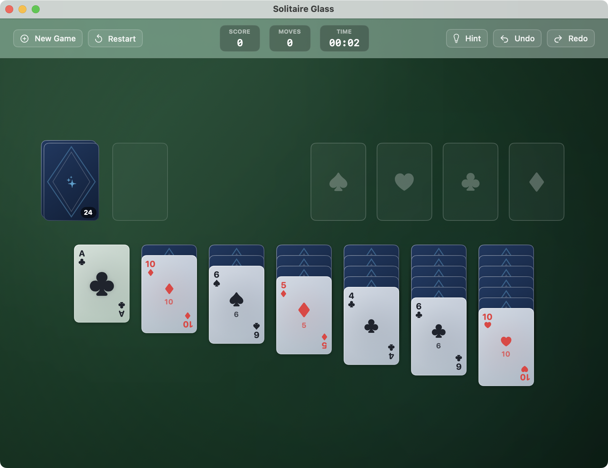
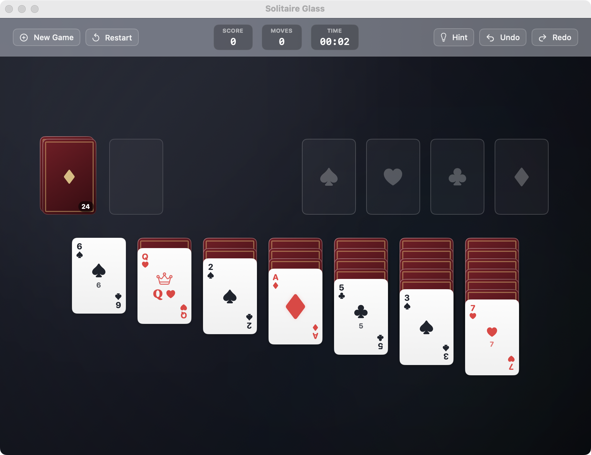
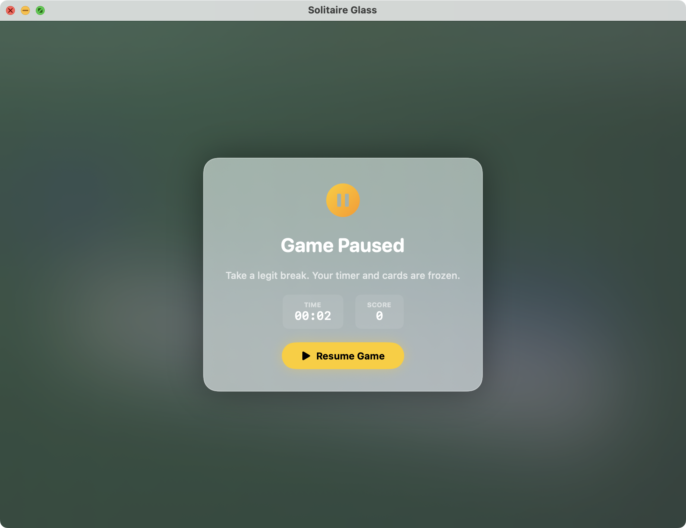

# Solitaire Glass (macOS SwiftUI)

A native macOS Klondike Solitaire game built with **Swift 6** and **SwiftUI**, featuring Apple's latest glassmorphic aesthetic (frosted acrylic materials, specular rim lighting, ambient dynamic felt/mesh gradients, and fluid physical card interactions).


---

## 📸 Screenshots

### Frosted Glass Deck on Emerald Felt


### Modern Classic Linen Deck on Midnight Obsidian


### Legit Break Pause Overlay


---

## 🎮 How the Game Works

Solitaire Glass implements the complete, authentic rules of classic **Klondike Solitaire** with physical drag-and-drop mechanics and modern macOS polish:

### 1. Game Board Layout
- **The Stock (Draw Pile)**: Located at the top-left, holding the remaining 24 cards. Click to deal 1 or 3 cards to the Waste pile. When empty, click to recycle the waste cards back into the stock.
- **The Waste (Discard Pile)**: Placed next to the stock. The top card is always available to drag to the Tableau or Foundation. In Draw 3 mode, cards are rendered in an overlapping fan.
- **The Foundations (4 Suit Piles)**: Located at the top-right, marked with subtle etched suit watermarks (♠, ♥, ♣, ♦). Build each suit up in ascending order from **Ace to King** (A, 2, 3... Q, K).
- **The Tableau (7 Columns)**: Columns 1 through 7 start with 1 to 7 cards respectively, with only the bottom-most card face-up. Cards are built down in **descending rank** with **alternating colors** (e.g. Red 9 on Black 10). Empty columns can only be filled by a **King** (or a stack starting with a King).

### 2. Interaction & Drag-and-Drop Model
- **Physical Drag-and-Drop**: Built with fluid gesture tracking. Lifting a card dynamically scales it up, adds an elevated drop shadow, and illuminates legal destination slots with a soft glowing rim.
- **Multi-Card Stack Dragging**: Dragging any face-up card in a tableau column lifts all face-up cards beneath it as a unified stack.
- **Auto-Flip**: Moving cards away from a tableau column automatically reveals and flips the newly exposed face-down card.

### 3. Scoring Modes
- **Standard Scoring**:
  - Waste to Tableau: `+5 pts`
  - Waste to Foundation: `+10 pts`
  - Tableau to Foundation: `+10 pts`
  - Turn over Tableau card: `+5 pts`
  - Foundation back to Tableau: `-15 pts`
  - Stock Recycle: `-100 pts` (Draw 1 mode) or `-20 pts` after 3 passes (Draw 3 mode)
  - Timed Bonus: Awarded upon winning based on elapsed time (`max(0, 700,000 / seconds)`).
- **Vegas Scoring**:
  - Starts at `-$52` (buying the deck for $1 per card).
  - Each card placed into the foundation awards `+$5`. Maximum profit: `+$208`.

### 4. Smart Assists & Quality of Life
- **Pause & Resume Timer** (`Cmd+P`): Need to step away? Click the pause button in the HUD or press `Cmd+P`. A frosted glass modal freezes the timer and hides active cards so your timed score remains honest. Click "Resume" to jump right back in.
- **Configurable Undo & Redo** (`Cmd+Z`, `Cmd+Shift+Z`): Seamlessly reverses moves, score changes, and flipped cards. Can be disabled in Settings for players seeking strict tournament-style gameplay.
- **Smart Hint System** (`Cmd+H`): Analyzes the board in real-time to find safe foundation transfers, hidden card revelations, or stock draws.
- **Auto-Finish Button** (`Cmd+Shift+A`): Appears automatically when all cards on the tableau are face up and the stock/waste are cleared, cascading the remaining cards to the foundations.
- **Celebratory Win Cascade**: Iconic 60/120fps physics simulation with gravity and card trail stamping when the game is won.
- **Procedural Audio Engine**: High-fidelity synthesized audio feedback for card slides, flips, felt taps, foundation chimes, and win fanfare using `AVAudioEngine`.

---

## 🎨 Customization & Appearance

Accessible via **Preferences / Settings** (`Cmd+,`):

| Setting | Options |
| :--- | :--- |
| **Card Deck Style** | Translucent Frosted Glass vs Modern Classic Linen |
| **Interface Appearance** | System, Dark Mode, Light Mode |
| **Table Background** | Emerald Felt, Midnight Obsidian, Royal Blue Felt, Velvet Nebula, Aurora Glass, or **Custom Image** |
| **Card Back Design** | Geometric Glass, Royal Sapphire, Crimson Velvet, Obsidian Minimal, or **Custom Image** |
| **Draw Mode** | Draw 1 (Casual) or Draw 3 (Challenging) |
| **Scoring Mode** | Standard or Vegas |
| **Enable Game Timer** | Toggle On / Off |
| **Enable Undo & Redo** | Toggle On / Off (hide buttons & enforce strict moves) |
| **Audio Controls** | Master sound toggle and volume slider |
| **Statistics** | Total games, win percentage, current & longest streak, best time, and high scores |

---

## 🚀 Guide to Running the Game

### Prerequisites
- macOS 14.0 (Sonoma) or macOS 15.0+ (Sequoia)
- Xcode 16.0+ (or Apple Command Line Tools)
- [XcodeGen](https://github.com/yonaskolb/XcodeGen) (optional, if you want to regenerate the `.xcodeproj` from `project.yml`)

### Method 1: 1-Click Install to Applications (Easiest)
Run the provided installer script to build the Release configuration, copy to `/Applications/Solitaire Glass.app`, register with LaunchServices, and launch it:

```bash
./scripts/install-app.sh
```

### Method 2: Package Release App & DMG Installer
To compile the standalone Release `.app` and generate a drag-and-drop `.dmg`:

```bash
./scripts/package-app.sh
```
Outputs:
- **Application Bundle**: `dist/Solitaire Glass.app`
- **Installer DMG**: `dist/SolitaireGlass-Installer.dmg`

### Method 3: Running in Xcode (Recommended for Development)
1. Open [`SolitaireGlass.xcodeproj`](SolitaireGlass.xcodeproj) in Xcode:
   ```bash
   open SolitaireGlass.xcodeproj
   ```
2. In the toolbar, ensure the **SolitaireGlass** scheme and **My Mac** destination are selected.
3. Press **Run** (`Cmd + R`) or click the Play button.

### Method 4: Running Automated Unit Tests
To verify game rules, deck generation, move validations, and statistics:
```bash
xcodebuild -project SolitaireGlass.xcodeproj -scheme SolitaireGlassTests test
```

---

## ⌨️ Keyboard Shortcuts

| Shortcut | Action |
| :--- | :--- |
| `Cmd + N` | Start New Game |
| `Cmd + R` | Restart Current Game (same deal) |
| `Cmd + P` | Pause / Resume Timer (Legit Break) |
| `Space` | Draw Card(s) from Stock / Recycle Waste |
| `Cmd + Z` | Undo Move (when enabled) |
| `Cmd + Shift + Z` | Redo Move (when enabled) |
| `Cmd + H` | Request Strategic Hint |
| `Cmd + Shift + A` | Auto Finish (available when all cards are face up) |
| `Cmd + ,` | Open Preferences & Theme Customization |
